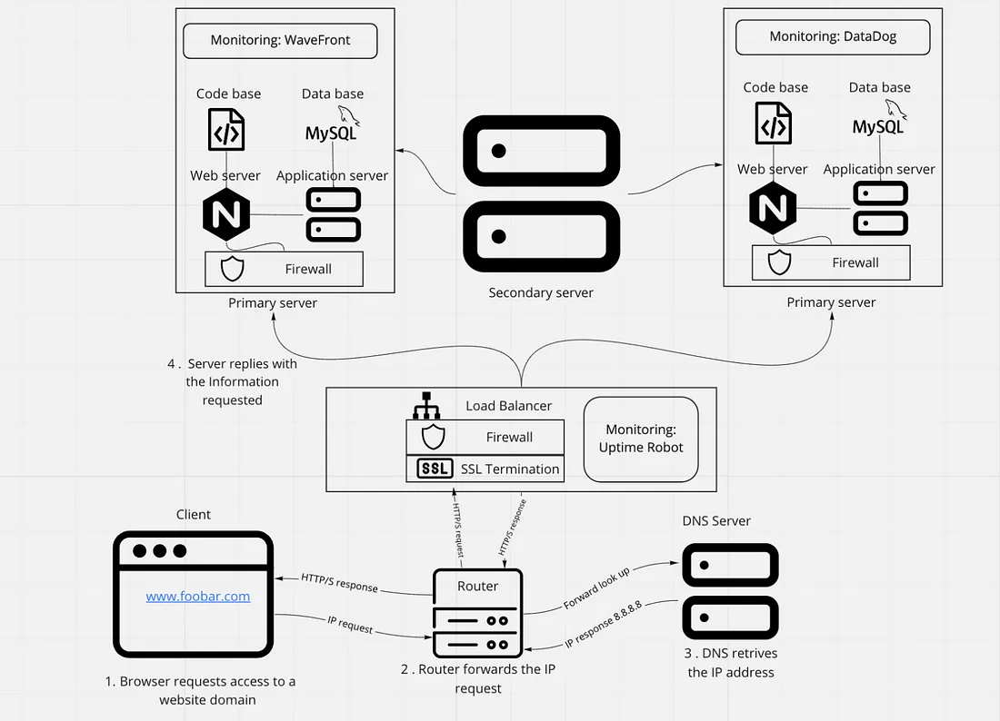

# Simple Web Stack

## Description

This is a simple web infrastructure that hosts a website that is reachable via `www.foobar.com`. There are no firewalls or SSL certificates for protecting the server's network. Each component (database, application server) has to share the resources (CPU, RAM, and SSD) provided by the server.

#For additional element, why you are adding it?

The new configuration is composed of two master-servers and one slave-servers. As the master-servers are going to be working based on a Active-Active set up, their configuration must be identical, therefore we need to add every additional element as the simple web infrastructure we had in the previous point. The load is going to be managed through a load-balancer, which distributes the queries according to a Robin-Round algorithm. Finally an additional server will be needed to serve a replica or slave server, helping to unload the masters servers reading queries.

What distribution algorithm your load balancer is configured with and how it works

Our load-balancer is using a Round Robin algorithm distribution. Meaning the queries requested are distributed to every server sequentially one after another. And after sending the request to the last server, the algorithm startarts from the first server. This will bring on average and approximately, to a server load distribution of 50% on each of the two servers configuration.

#Is your load-balancer enabling an Active-Active or Active-Passive setup, explain the difference between both

Our load-balancer is enabling an Active-Active set up.

The Active-Active cluster is typically made up of at least two nodes, both activaley running the same type of services at the same time. Their purpose is to achieve load balancing by distributing tasks to different servers in order to prevent overload. As there are more than one servers (nodes) available to severe, the service time and process throughput can have improvements.

On the other hand the Active-Passive setup, also made up of at least two nodes (servers), however not all nodes are going to be active simultaneously. In this configuration, while one node is active, the other nodes (failover servers) are passively waiting to be active as backup in case the primary server (the one being in use actively) is disconnected or unable to serve. Under this configuration, and as in the Active-Active set up, it is important that primary and failover nodes have the exact server configuration, so clients won’t be able to tell the difference when the failover server takes over the operation (Villanueva, 2017).

#How a database Primary-Replica (Master-Slave) cluster works

A database Primary-Replica (Master-Replica) is a mechanism which enables data of one database server (the master) to be replicated or to be copied to one or more computers or database servers (the slaves), in order all users share the same level of information. This process leads to a distributed database in which users can quickly access data without interfering with each other.

The database replication process can either be synchronous or asynchronous. In the first one, the replication process is done from the client server to the model server and then replicated to all the replica servers before the client is notified about the data replication. This method of replication may take longer to verify, however all data was copied before proceeding.

As in the asynchronous replication process, replication is done by sending data from the client to the model server, followed by a confirmation order to the client, who finally gives permission of copying to the replicas at an unspecified or monitored pace (Lutkevich, 2020)

#What is the difference between the primary node and the replica node in regard to the application.

One of the main differences between the primary node and the replica node, regarding the application, is that the primary database is regarded as the authoritative source, while the replica database is synchronized to it. The primary node serves as the keeper of information, here the “real” data is kept, then writing only happens here. On the other hand, reading only occurs in the replica or slave node. This architecture purpose is due to safeguard site reliability. In case a site receives a lot of traffic, a replica node prevents overloading of the master node with reading and writing requests. This eases the load of the entire system preventing it to collapse (Theodorus, 2020).
